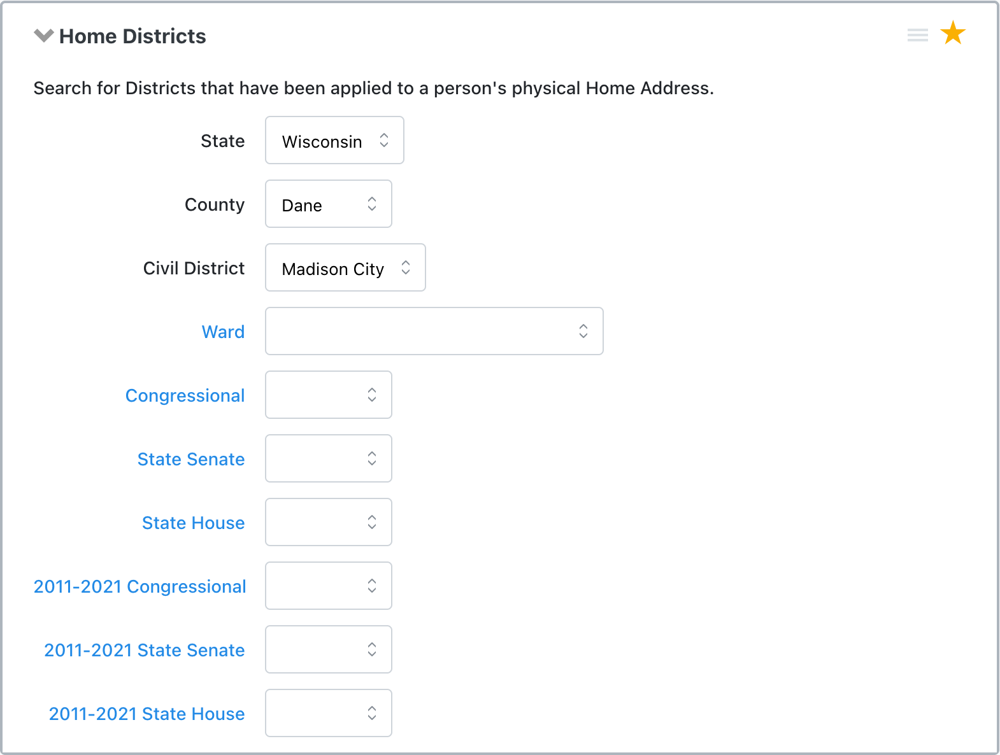
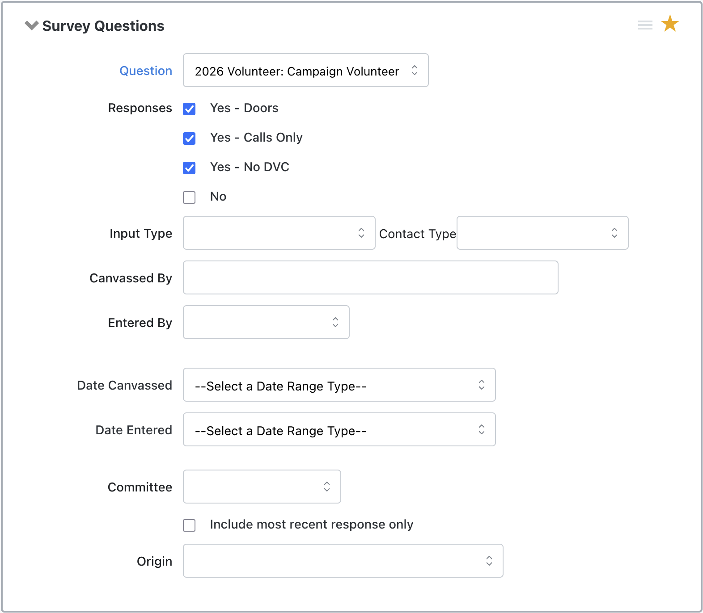
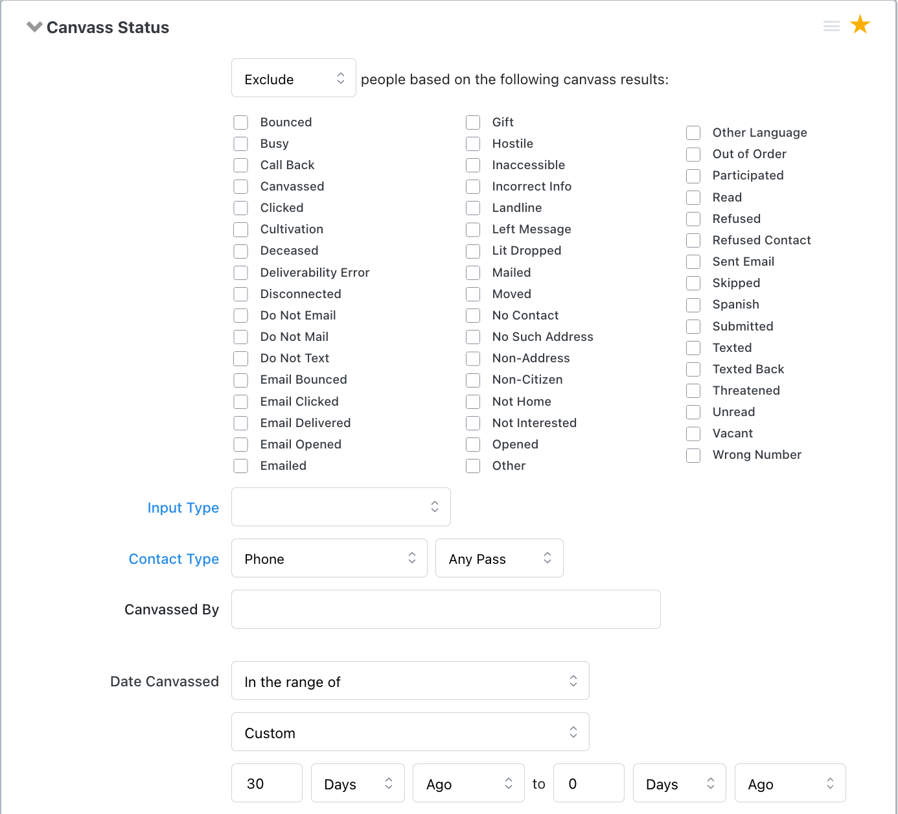
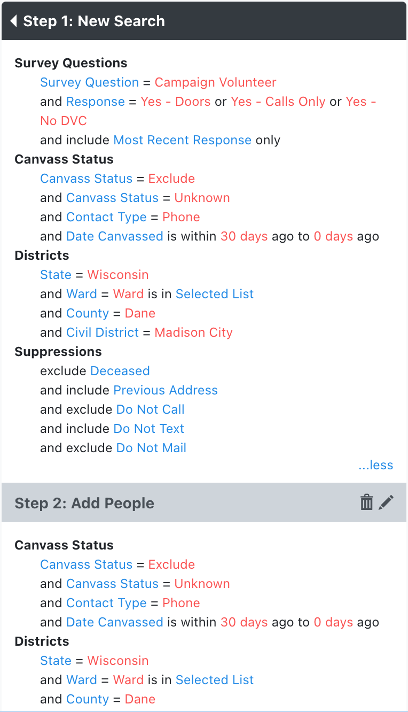
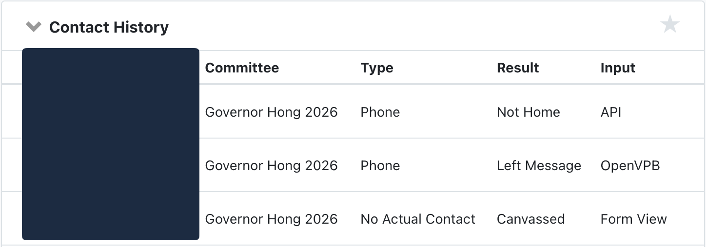
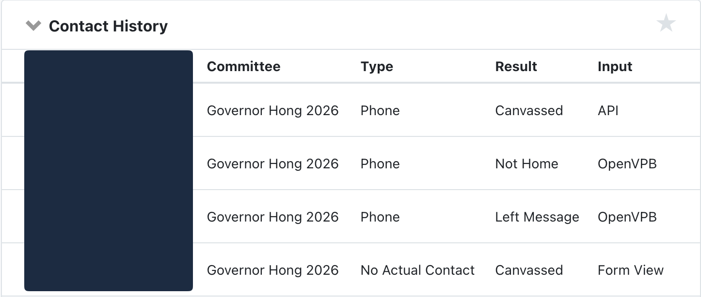

These are [how-to guides](https://docs.divio.com/documentation-system/how-to-guides/).

This documentation provides one way to accomplish a task. This is not the only way to accomplish these tasks!

# Export canvasser list to CSV
1. Click `My Campaign`
2. In the sidebar, click `Event List`
3. Filter for your event
    - Use `Event Name` and follow the naming convention for your RC
    - Use other filters as needed
4. Click your event
    1. You are taken to the event page for your event
5. In the upper right, click `Participant Actions` --> `View Participants`
    1. You are taken to the `Event Participant List` page filtered down to your event
6. In the upper right, click `Export to CSV`

You now have a CSV you can manipulate as needed (copy to canvass tracker spreadsheet, etc.)!

# Create volunteer recruitment phone bank list (advanced)
Building on top of the basic training, this lets you:
- Include multiple civil districts and multiple wards from your RC
- Exclude people who were previously called and answered the phone

1. Go to `My Campaign` tab
2. In sidebar, `Create a List`
3. Criteria for Add Step:
    1. Home Districts:
        1. State: `Wisconsin`
        2. County: `<your county>`
        3. Civil District: `<your civil district>`
        - 
        4. Click the `Ward` field label to multi-select wards
            1. Check each ward in your RC
        5. You now have all the wards in this district selected
    2. Survey Questions:
        1. Question: `2026 Volunteer: Campaign Volunteer`
        2. Responses:
            1. `Yes - Doors`
            2. `Yes - Calls Only`
            3. `Yes - No DVC`
        - 
    3. Canvass Status
        1. `Exclude` people based on the following canvass results:
            1. Check `Canvassed`
        2. Contact Type: `Phone`
        3. Date Canvassed: `In the range of`
            1. `Custom`
            2. `7` Days Ago to `0` Days Ago
            3. *Adjust the days ago as appropriate*
        - 
4. On the right, click `Add Step` --> Click `Add People`
5. Repeat step 3-4 for each **Civil District**
6. Final result should look like this:
    - 
7. Save your search following the naming convention (minus date since this is a reusable search)

You now have a phone bank list for all wards in your RC that excludes anyone who has picked up the phone in the last 7 days.

## Alternative criteria
Depending on your situation, you might want to exclude any type of phone contact. Unchecking all the canvass results checkboxes will include any canvass result. In other words, `any canvass result` + Contact Type: `Phone` = anyone who's been called.

This is the list of Canvass Results that OpenVPB callers can select for non-answers:
- `Not Home`
- `Refused`
- `Deceased`
- `Moved`
- `Call Back`
- `Busy`
- `Left Message`
- `Wrong Number`
- `Disconnected`

Autodialer currently uses `API` as the input type.

`OpenVPB` for phone bankers using openvpb.

<!--  -->
<!--  -->


# Javascript to automate ward checkboxes
- Replace with your list of wards

```javascript
(function () {
  const inputWards = [
    "Dane - City Of Madison - Ward 058",
    "Dane - City Of Madison - Ward 059",
    "Dane - City Of Madison - Ward 060",
    "Dane - City Of Madison - Ward 061",
    "Dane - City Of Madison - Ward 062",
    "Dane - City Of Madison - Ward 063",
    "Dane - City Of Madison - Ward 064",
    "Dane - City Of Madison - Ward 065",
    "Dane - City Of Madison - Ward 066",
    "Dane - City Of Madison - Ward 067",
    "Dane - City Of Madison - Ward 069",
  ];
  const normalizeWhitespace = (s) =>
    s
      .replace(/[\s\u00a0]+/g, " ") // replace nbsp
      .trim()
      .toLowerCase();
  const normalizedInputWards = new Set(inputWards.map(normalizeWhitespace));
  let checkedCount = 0;
  const foundWards = new Set();

  document
    .querySelectorAll('input[type="checkbox"][name="SelectedValues"]')
    .forEach((checkbox) => {
      const label = checkbox.closest("label");
      if (!label) {
        return;
      }
      const normalizedLabel = normalizeWhitespace(label.textContent);
      if (normalizedInputWards.has(normalizedLabel)) {
        checkbox.checked = true;
        checkedCount++;
        foundWards.add(normalizedLabel);
      }
    });

  const notFoundWards = inputWards.filter(
    (ward) => !foundWards.has(normalizeWhitespace(ward)),
  );

  console.log(`Checked ${checkedCount} of ${inputWards.length} wards.`);

  if (notFoundWards.length) {
    console.warn("Not found:", notFoundWards);
  }
})();
```
